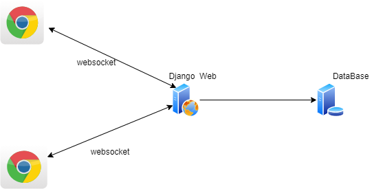
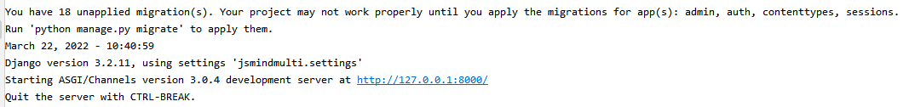
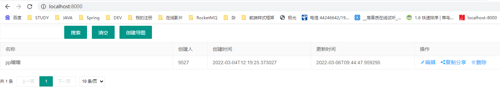

# jsmindmulti

jsMind思维导图多人协作版（可本地安装、可扩展源码）

#### 介绍

+ 多人协作脑图站在巨人的肩膀上，前端是有名的开源JS框架 [【jsMind】](http://hizzgdev.github.io/jsmind/developer.html) 
  1. 可自己改源码，接口丰富、扩展性强
  2. 本工具中对jsMind源码做了小小的改动，并做了相关备注；
+ 适合不能访问外网、或者不想把数据放外网的公司
  1. 现在很多互联网免费的协作脑图产品，但是有的敏感数据并不想放外网
+ 多人协作思维导图主要采用python django web框架，如果不熟悉的可以先补一下；
  1. Django快速入门视频推荐：[https://www.bilibili.com/video/BV1JW411i7W1](https://www.bilibili.com/video/BV1JW411i7W1)
+ 选择python是因为感觉用django开发一个简单网页会比java更快，但是这里我要吐槽一下python里用缩进区分语句块，稍不注意代码就乱了（感觉还是大括号好）

#### 软件架构

<hr>



<hr>

#### 安装教程

+ 安装依赖
    - 安装 [Python](https://www.python.org/downloads/) ，我本地(win系统)安装的是 [Python 3.7.8rc1](https://www.python.org/downloads/release/python-378rc1/) ，版本比这个大就应该可以
    - 安装依赖，在工程根目录执行 pip install -r requirement.txt 将项目的依赖安装到python目录（类似java里的maven），如果想把相关依赖安装到其他目录进行分类管理可以采用virtualenvwrapper
    -
    

+ 数据库
    - 在 jsmindmulti/settings.py 的 DATABASES 进行配置，配置文件里默认用的mysql，可以改成django支持的数据库（官方文档：https://docs.djangoproject.com/en/3.2/ref/settings/#databases 和 https://docs.djangoproject.com/en/3.2/ref/settings/#std-setting-DATABASE-ENGINE ）
    -
    
    - 初始化数据库脚本，在manage.py所在目录执行以下命令就会将系统运行所需要的表结构创建好
      ```
       python manage.py makemigrations
    
       python manage.py migrate
      ```

    - 核心数据主要存在这两个表中：
      ```
      -- 思维导图快照表(通过界面js定时推送方式保存脑图快照数据)
      select * from cooperation_mind  order by id desc;
      
      -- 思维导图操作日志表(实时保存操作日志数据)
      select * from cooperation_mind_log order by id desc;
      ```
+ 启动程序
    - 开发环境启动可以在项目根路径里直接执行 python manage.py runserver 0.0.0.0:8000 开启本地的服务；如果是生产环境，还需要加入nginx(我理解是提高并发等，参考：https://www.jianshu.com/p/3172566156fe/)
    -
    - 

#### 效果

+ 通过浏览器 http://localhost:8000/ 访问主页
+ 列表展示如下：
  


+ 打开多个浏览器点击"编辑"详情进行编辑


#### last

+ 如有使用本工具，可在评论区备注留下贵公司名字